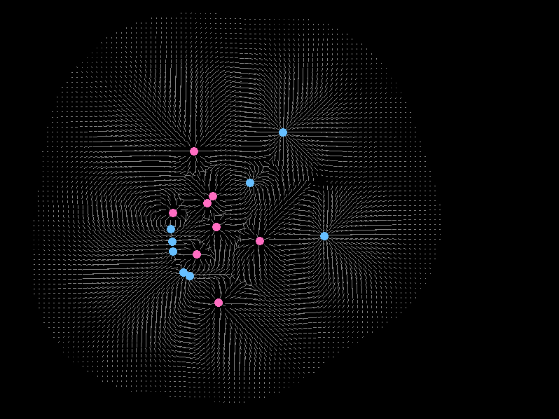

# Overview
Source code for simulation projects developed while reading Computer Simulation Using Particles by RW Hockney and JW Eastwood.

# Models
## Basic Particle-Particle Model
`basic_pp_model.c` is the simplest particle to particle simulation of charged particles. Coulomb's Law is used as the force law.

**Simulation pseudo code**
```
state:
    N <- particle count
    f <- force accumulators
    x <- positions
    v <- velocities
    q <- electric charges
    t <- simulation time

1. Compute forces.
    Clear force accumulators
    for each i in { 0..N }
        for each j in { i..N }
            f_ij <- Force between particles i and j
            state.f[i] += f_ij
            state.f[i] -= f_ij

2. Integrate equations of motion
    dt <- time between simulation steps
    mass <- particle mass
    for each i in { 0..N }
        state.x[i] += state.v[i] * dt
        state.v[i] += state.f[i] / mass * dt

3. Update time counter
    t += dt
```


## Basic Particle-Mesh Model
`basic_pm_model.c` draws the electric field around static charged particles. Instead of computing the interactions between each particle, the particle mesh method computes the electric field mesh around the particles. This mesh then can be used to infer the force exerted on each particle. For many particles, this method is more computationally efficient than the Particle-Particle method, since the grid size is fixed and the execution time scales linearly in function of the particle count (as opposed to exponentially).

**Simulation pseud code**
```
state:
    N <- particle count
    f <- electric field 2D mesh
    x <- particle positions
    q <- particle charges
    t <- simulation time

1. Calculate electric field
    Clear electric field
    Sum the force exerted by each particle on each mesh point.
    state.f[i][j] += f_ijp

2. Update time counter
    t += dt
```



